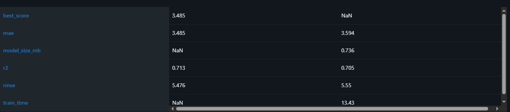

# Module 2 Report — The Pipeline That Retrains Itself

## Experiment tracking
Three model families (`lr`, `xgboost`, `mlp`) trained on identical splits, all logged to MLflow (Postgres backend store, MinIO artifact store). Every run logs:
- **Params** — hyperparameters, split seed, data version hash
- **Metrics** — RMSE, MAE, R², train duration, model size
- **Artifacts** — model, residual plot, feature-importance plot, `requirements.txt` snapshot
- **Tags** — `framework`, `author`, `git_commit`, `data_version` (`src/prodml/tracking.py`)

`mlflow.xgboost.autolog()` enabled for the xgboost family. Hyperparameter sweep: Optuna, `50` trials on xgboost, each a nested run.

## Model registry
`taxi-duration` registered; lifecycle `None → Staging → Production`, managed by `promote_if_better()` (`src/prodml/registry.py`) — called automatically after every `prodml.tuning` run.

`predict.py` supports loading by registry stage (`load_from_registry()`), gated behind a `LOAD_FROM_REGISTRY` setting — used for local/dev demonstration. The deployed Docker image loads the DVC-tracked pickle instead, since a deployed container has no guaranteed network path to a local-only MLflow instance.

## Data versioning (DVC)
- `data/green_tripdata_2024-01.parquet` and `models/model.pkl` are DVC-tracked; remote: Backblaze B2 (`champion-store`)
- Every MLflow run is tagged with `data_version` (the DVC file's md5 hash), so any registered model traces back to the exact bytes it was trained on
- `models/model.pkl` is re-synced by `promote_if_better()` whenever a new candidate wins, keeping the DVC-tracked artifact consistent with whatever MLflow calls Production

## CI/CD
Three jobs in `.github/workflows/ci.yml`: `lint → test → build`
- `lint`: `ruff check`, `black --check`
- `test`: pytest with the coverage gate, then `scripts/check_mae_regression.py` comparing `metrics/new_run.json` against `metrics/production.json` — blocks merge if MAE regresses by more than 5%
- `build` (main only): `dvc pull` the champion model, build + push the Docker image to Docker Hub

## Continuous training
| Trigger | Implemented? |
|---|---|
| Manual (local retrain → `dvc push` → `git push` → CI gates + builds) | Yes |
| `schedule` (cron) | No — requires a publicly reachable MLflow tracking server, deferred |
| `repository_dispatch` | No — same reason |
| New labeled data | No |

Training happens locally, where MLflow/Postgres actually live — GitHub-hosted runners have no network path to reach them. CI's role is strictly to gate the metrics, build, and push; it never trains.

Promotion to Production happens locally (inside `promote_if_better()`, called from `prodml.tuning`) before the artifact is ever pushed, rather than behind a CI-side human-approval gate as the handbook describes for a fully cloud-hosted pipeline. Worth stating this trade-off directly rather than leaving it unaddressed.
